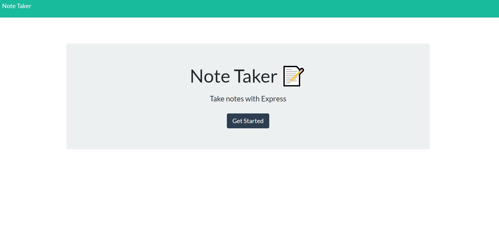
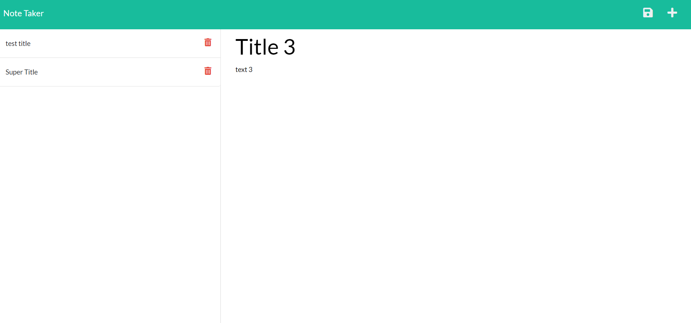

# express-note-taker
  

  ## Description:
  ___
  a backend server using express that supports a front end html for note taking. Deployed on heroku.

  ## Table of Contents:
  ___
  1) [Description](#description)
  2) [Installation](#installation)
  3) [Usage](#usage)
  4) [Video](#video)
  5) [Collaboration](#collaboration)
  6) [Tests](#tests)
  7) [Questions?](#questions?)
  8) [GitHub](#gitHub)
  9) [License](#license)

  ## Installation
  ___
  visit the deployed app at: [Note Taker Homepage](https://arcane-escarpment-84918.herokuapp.com/notes.html)

  ## Usage
  ___
  Used for practice designing a server that performs GET, POST, and DELETE functions.

  ## Video
  ___
 No video yet available. Here are some images:

  ## Collaboration:
  ___
  For now, just follow the [Contributor Covenant](https://www.contributor-covenant.org/)

  ## Tests
  ___
  none yet

  ## Questions?
  ___
  Please contact me at:
  My [GitHub](https://github.com/Windowmac)
  
  Or Email:
  <mckendree.strommer@gmail.com>

  
  ## License: 
  ___
  Licensed under [GNU GPL v3](https://www.gnu.org/licenses/gpl-3.0)